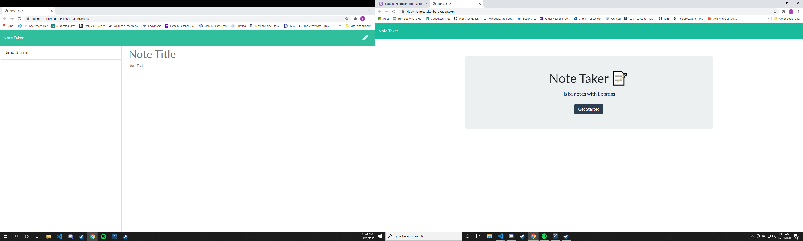

# Note Taker

## Description
Using Heroku to save and store api requests for generating notes.

## Table of Contents

* [Description](#description)
* [Installation](#installation)
* [License](#license)
* [Links](#links)
* [Question](#questions)

## Installation
install npm i

## License
MIT

## Screenshot

## Links
https://github.com/sethklusmire/noteTaker
https://klusmire-notetaker.herokuapp.com/

## Questions
If you would like reach out my email is [sethklusmire@gmail.com](sethklusmire@gmail.com) and my GitHub page is https://github.com/sethklusmire
